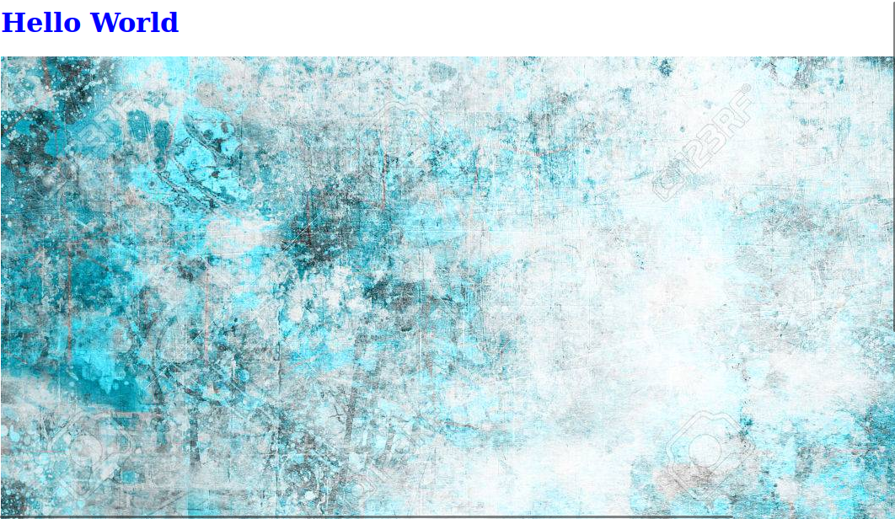

# Hello world

este es un projeco de cracion de un titulo y un imagen en una pagina web


```
git colone (repositorio compañero)
(moverse al directorio)
git checkout -b nombrerama
(modificar fichero)
git commit
```
